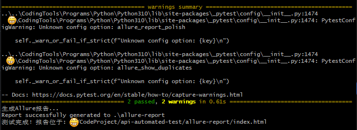
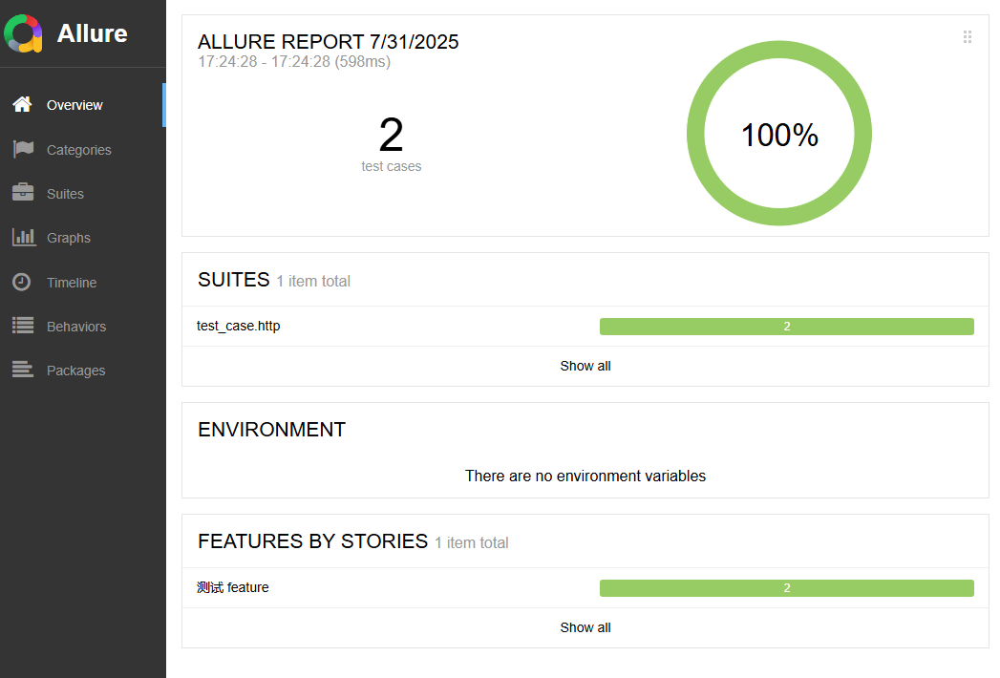

Framework Design:

TODO:

1. Add an RPC service discovery module

2. Add automatic client code generation

I. What does the test framework need?

Single interface and scenario support for http and rpc requests

II. Framework advantages:

Quick implementation, support for multiple computer rooms, multiple clusters, and multiple test environments

III. HTTP and rpc are designed separately and then abstracted and merged

Framework layering:

tools -- tool layer, independent of the framework

config -- configuration, computer room environment configuration

test_data -- test data, request data

test_case -- test case

client -- secondary encapsulation of the interface

base_client.py -- test

conftest -- instantiate the client, all clients are instantiated uniformly, and then called by test_case

reprot -- test report

IV. How to use

1. Environment configuration

(1) Install the python3 environment

(2) Install the allure-2 tool

(3) Install third-party dependencies, run in the project root directory: `pip install -r requirements.txt`

2. Test demo design

(1) Configure the allowed data center information -- config/

 (2) Encapsulate a client for global direct call -- client/

 (3) Prepare test data (request parameters, request header information) -- test_data/

 (4) Instantiate (add @pytest.fixture(scope="session")) for global call; multiple conftest managers can be set up according to the situation -- conftest.py

 (5) Case implementation -- test_case/

 3. Run the test script

 Run the shell script in the project root directory: `./main.sh`

 4. View the report

 (1) Manually open the path: `dir: allure-report/index.html`

~ ~ ~ ~ ~ ~ ~ ~ ~ ~ ~ ~ ~ ~ ~ ~ ~ ~ ~ ~ ~ ~ ~ ~ ~ ~ ~ ~ ~ ~ ~ ~ ~ ~ ~ ~ ~ ~ ~ ~ ~ ~ ~ ~ ~ ~ ~ ~ ~ ~ ~ 

框架设计：

TODO:

1、添加 rpc 服务发现模块

2、添加自动生成client代码功能

一、需要测试框架做一些什么？

​	支持http、rpc请求的单接口和场景化

二、框架优势：

​	快速落地、支持多机房、多集群、多测试环境

三、http，rpc分开设计、再抽象合并

​	框架分层：

​		tools -- 工具层，和框架独立

​		config -- 配置，机房环境配置

​		test_data -- 测试数据，请求数据

​		test_case -- 测试用例

​		client -- 对接口的二次封装

​			base_client.py -- 测试

​		conftest -- 实例化client，全部client统一实例化，然后再test_case调用

​		reprot -- 测试报告

四、如何使用

​	1、环境配置

​	（1）、安装 python3 环境 

​	（2）、安装 allure-2 工具

​	（3）、安装第三方依赖，项目根目录下运行： `pip install -r requirements.txt`

​	2、测试demo设计

​	（1）、配置允许机房信息 -- config/

​	（2）、封装一个 client 全局直接调用 -- client/

​	（3）、准备测试数据（请求参数、请求头信息）-- test_data/

​	（4）、实例化（添加 @pytest.fixture(scope="session")）全局调用；根据情况可设置多个conftest管理 -- conftest.py
​	（5）、case 实现 -- test_case/

​	3、运行测试脚本

​	项目根目录下运行shell脚本：`./main.sh`

​	4、查看报告

​	（1）、手动打开路径：`dir: allure-report/index.html`

